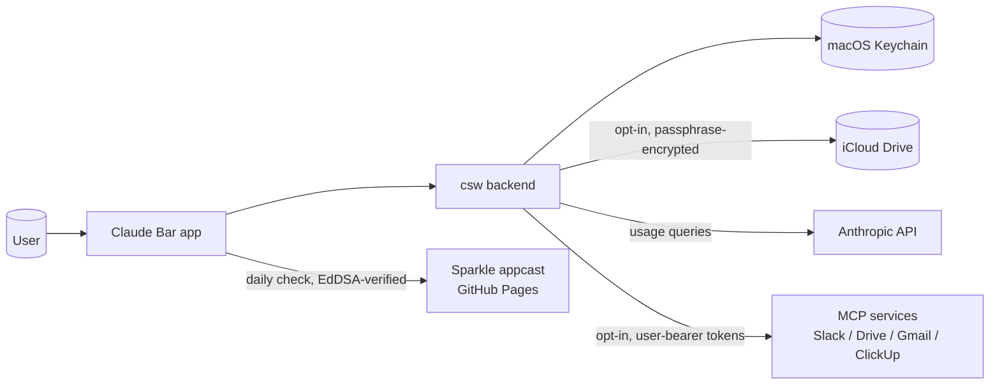

# Security

> _Last reviewed: 2026-05-23._
> Report vulnerabilities to **nc.thanhngo@gmail.com** with subject prefix `[security]`.

## TL;DR

- **Local-first.** Auth tokens, MCP tokens, and account configs stay in the macOS Keychain on your Mac.
- **Opt-in cloud.** Nothing leaves your Mac for sync, MCP, or updates unless you explicitly enable it.
- **No telemetry.** No analytics, no usage beacons, no crash uploads — diagnostics are sent only when you click Send.

## What stays on your Mac

| Data | Storage |
|------|---------|
| Claude Code OAuth tokens (active + per-account backups) | macOS Keychain (`com.apple.security`) with ACLs that restrict access to Claude Bar's bundle ID. |
| MCP connector tokens (Slack, ClickUp, Google Workspace) | macOS Keychain. Shared tokens use a single keychain item; per-account overrides use one item per account. |
| Account list, nicknames, preferences | `~/Library/Application Support/claude-bar/` and `NSUserDefaults` under `dev.ncthanhngo.claude-bar`. |
| Diagnostic logs | `~/Library/Logs/ClaudeBar/` (rolling 5 MB × 3 archives). |
| Session usage data | Read-only from `~/.claude/projects/**/*.jsonl` — Claude Code's own files. |

## What leaves your Mac and when

| Destination | Purpose | When |
|-------------|---------|------|
| `api.anthropic.com` | Fetch usage / quota for the active account's OAuth token. | Every refresh tick (adaptive 2–3 min) while the popover is open or the menu-bar icon shows usage. |
| `claude.ai` (embedded WebKit) | Optional per-account web-usage fallback when the API path returns rate-limited or insufficient data. | Only after you click **Connect web usage** for a specific account. |
| iCloud Drive (`ubiquity` container) | Sync the encrypted account + MCP-token bundle across Macs sharing the same Apple ID. | Only after you click **Enable sync** and enter a passphrase. Background sync every ~6h once enabled. |
| MCP services (Slack, ClickUp, Google) | Whatever the service-side OAuth scopes allow — typically read-only search/list calls. | Only after you authorize each connector. Tool calls happen during Claude Code conversations that use those tools. |
| Sparkle appcast (GitHub Pages) | Check for new app versions. The appcast is a static XML file; downloads are GitHub Releases assets. | Daily passive check; user-initiated via **Check for updates**. EdDSA-signed; tampered updates are refused. |
| `nc.thanhngo@gmail.com` (diagnostics) | Last 200 log lines, app version, macOS version. | Only when you click **Send diagnostics…** in Settings → Diagnostics. Pre-filled in your default mail client — you can edit before sending. |

## Trust boundaries

If the Mermaid diagram doesn't render, the prose summary is: **User → App → Backend (`csw`).** Backend talks to Keychain (always), Anthropic (for usage), iCloud + MCP services + Sparkle (only when opted in).

## Threat model

| Threat | Mitigation | Residual risk |
|--------|------------|---------------|
| Local malware reads tokens from Keychain. | Keychain ACL restricts the items to Claude Bar's bundle ID. FileVault recommended for at-rest disk encryption. | A privileged attacker can override Keychain ACLs; FileVault protects only powered-off devices. |
| Lost / stolen device. | FileVault (recommended). Keychain items are not accessible when the device is locked. | If the user disabled FileVault and the device is unlocked when stolen, all bets are off. |
| iCloud account compromise. | iCloud bundle is AES-256-GCM encrypted with a passphrase that never leaves the user's Macs. iCloud Keychain sync is OFF for the Claude Bar passphrase (`kSecAttrAccessibleWhenUnlockedThisDeviceOnly`). | The attacker can download the encrypted bundle but cannot decrypt without the passphrase. Weak passphrases are still a risk — choose a strong one. |
| Malicious MCP service. | Each connector is opt-in. Tool calls flow through Claude Code's permission prompts. Tokens are user-bearer scoped to the service's OAuth scopes. See [docs/local-mcp-threat-model.md](./docs/local-mcp-threat-model.md). | A compromised MCP service can exfiltrate tool-call inputs (search queries, message bodies it sees). |
| Tampered auto-update. | Sparkle verifies an EdDSA signature on every downloaded zip. The public key is embedded in the app's Info.plist; the private key lives only in a GitHub Actions secret. | If the user installs a build with `SUPublicEDKey` set to a key they don't trust, this falls through. Stick to official releases. |

## Reporting vulnerabilities

- **Email:** nc.thanhngo@gmail.com, subject prefix `[security]`.
- **Response time:** best-effort; this is a side project run by one maintainer. Critical issues will be acknowledged within 72 hours.
- **Disclosure:** please give 30 days for a fix before public disclosure.
- **No bug bounty.** Sorry — no budget for one. Credit is offered for confirmed reports.

## Further reading

- [docs/local-mcp-threat-model.md](./docs/local-mcp-threat-model.md) — STRIDE-style analysis of the local MCP gateway.
- [docs/tech-note-icloud-sync-risks.md](./docs/tech-note-icloud-sync-risks.md) — what we encrypt, how the passphrase is derived, what's left visible to Apple.
